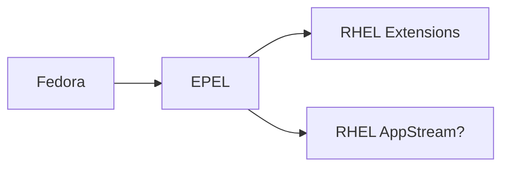

In today's post I would love talk with you all about an exciting open source
project, [Goose](https://github.com/block/goose).

But before we deep dive on why Goose is so amazing, let me give you some
backstory context first.

## Let's start from the beginning

Back in September, I got a task at my job in Red Hat to research about new
upstream AI clients. As many of you may imagine, there are dozens and dozens of
choices in the wild for you to pick your favorite, however, the intention
behind this was to join forces with such community and initiate an effort to
bring to Fedora and later to RHEL this upstream client.

This is not an easy task, as just "yeah, this feels good!". You need some data,
research, consideration and a bunch of other things to keep in mind. So, back
in September, I started researching the different variations of upstream
clients, with the intention to bring one of them to Fedora, and that's when I
landed my eyes on [Goose](https://github.com/block/goose).

Some of my team mates were already using Goose for some sporadic tasks here and
there, but neither of us actually had an opinion on it other than "It looks
pretty good!".

I have also to add in this context, that, even though I'm working for RHEL
Lightspeed, a team primarily dealing with AI toolings, I understand that the
primary thought is that I'm a die hard AI user. Well, hate to say, but... **not
that much**.

I have been using more AI lately for some side projects and searching, but I'm
not the kinda of person that lies all my coins on this technology. I think it's
useful, for sure, if you use it with caution and for specific actions, but, I
will reserve myself to talk about it in another post in the future.

Phew! Much context, right? Let's jump to the good part now.

## What were we looking for in the research?

Primarily, we were looking out for an LLM client that could match the following
basic criteria:

* Stdio redirection
* File attachments
* Interactive mode
* Simple question asking
* History management
* Shell bindings
* MCP support

I know this does not look an extensive or surprise to any one, but we figured
out that for a good LLM client, this was the most basic feature support we
could even ask for. In our conception, any LLM client, to be considered
"usable", would indeed check each of those criteria above.

Of course, all LLM clients out there have a miriad of features available, some
of them going even way beyond than we can imagine, but one requirement was the
most crucial for us. The **community** around the project.

## Which clients were considered in the research?

Well, we did a long list of analysis:

| Project Name 	| SCM URL                                                	| License                                                                                                                                    	| UXD Considerations                                                                                                                                                                                                                                                                                                                                                                                                                                                                                                                                     	| Other Details                                                                                                                                                                                                                                                                                                                                                                                                                                                                                                                                                                                                          	| Pros/Cons                                                                                                                                                           	|
|--------------	|--------------------------------------------------------	|--------------------------------------------------------------------------------------------------------------------------------------------	|--------------------------------------------------------------------------------------------------------------------------------------------------------------------------------------------------------------------------------------------------------------------------------------------------------------------------------------------------------------------------------------------------------------------------------------------------------------------------------------------------------------------------------------------------------	|------------------------------------------------------------------------------------------------------------------------------------------------------------------------------------------------------------------------------------------------------------------------------------------------------------------------------------------------------------------------------------------------------------------------------------------------------------------------------------------------------------------------------------------------------------------------------------------------------------------------	|---------------------------------------------------------------------------------------------------------------------------------------------------------------------	|
| Goose        	| [GitHub](https://github.com/block/goose)               	| [Apache](https://github.com/block/goose/blob/main/LICENSE)                                                                                 	| 👍 Session-based (modal) interaction method by default, with direct interaction [available](https://block.github.io/goose/docs/guides/running-tasks) 👍 Built-in [themes](https://block.github.io/goose/docs/guides/goose-cli-commands/#themes), but unclear on how custom theming works 😐 Desktop counterpart (does this provide the same, full functionality?), [web interface](https://block.github.io/goose/docs/guides/goose-cli-commands/#web) as well 😐 Possible opportunity for rich onboarding — existing configuration menus are good 	| Goose feels like the most complete project on the list. It has all the tools, functionality and features that we may require. (Written in Rust)                                                                                                                                                                                                                                                                                                                                                                                                                                                                       	| 👍Multi-provider support 👍 Custom provider 👍 MCP client 👍Extensions support (Bultin and community) 👎Different tech stack than the team knows             	|
| Gemini CLI   	| [GitHub](https://github.com/google-gemini/gemini-cli)  	| [Apache](https://github.com/google-gemini/gemini-cli/blob/main/LICENSE)                                                                    	|                                                                                                                                                                                                                                                                                                                                                                                                                                                                                                                                                        	| Since this does not offer multi-provider support, we would need to fork the proejct and continue on our own. While this is an option, we may lack the "contribute back to the community" aspect of our work, and we might lose new features due to being harder to rebase.                                                                                                                                                                                                                                                                                                                                             	| 👎No multi-provider support 👍 MCP client 👍 Bulti-in useful tool calling out of the box 👍 Focus on security                                                  	|
| LLM          	| [GitHub](https://github.com/simonw/llm)                	| [Apache](https://github.com/simonw/llm/blob/main/LICENSE)                                                                                  	|                                                                                                                                                                                                                                                                                                                                                                                                                                                                                                                                                        	| This is one of the most interesting projects we have in the list, but, it does not have mcp support (as of now). It would be a great fit if we didn't had to have mcp as required feature.  Also, it feels to me that this integrates very well with other datasette projects, so it would be a case where we would need to ship this project, plus a couple of more.                                                                                                                                                                                                                                            	| 👍Multi-provider support 👎Not an MCP client                                                                                                                       	|
| QWEN Code    	| [GitHub](https://github.com/QwenLM/qwen-code)          	| [Apache](https://github.com/QwenLM/qwen-code/blob/main/LICENSE)                                                                            	|                                                                                                                                                                                                                                                                                                                                                                                                                                                                                                                                                        	| It falls under the same category as any other gemini-cli based clients. It has a lot of functionality, it looks good, but in the end, there is no real multi-provider, we would need to fork and continue work separated from the community, and all else                                                                                                                                                                                                                                                                                                                                                              	| 👍Has MCP capabilities in the client 👍Multi-provider support                                                                                                      	|
| Open Code    	| [GitHub](https://github.com/sst/opencode)              	| [MIT](https://github.com/sst/opencode/blob/dev/LICENSE)                                                                                    	|                                                                                                                                                                                                                                                                                                                                                                                                                                                                                                                                                        	| We would need to fork the project as it does not accept core functionality PRs.   Nanocoder has a pretty good statement about opencode that I think it's worth to document here: https://github.com/Nano-Collective/nanocoder?tab=readme-ov-file#how-is-this-different-to-opencode                                                                                                                                                                                                                                                                                                                               	| 👎Does not accept Core PR                                                                                                                                            	|
| Crush        	| [GitHub](https://github.com/charmbracelet/crush)       	| [FSL-1.1-MIT](https://github.com/charmbracelet/crush/blob/main/LICENSE.md)                                                                 	|                                                                                                                                                                                                                                                                                                                                                                                                                                                                                                                                                        	| Some controversy about [git history rewrite](https://biggo.com/news/202507310715_Charm_Crush_AI_Coding_Agent)                                                                                                                                                                                                                                                                                                                                                                                                                                                                                                          	| 👎Not so open-source license 👎Does not feel like an CLI app                                                                                                       	|
| Codex        	| [GitHub](https://github.com/openai/codex)              	| [Apache 2.0](https://github.com/openai/codex/blob/main/LICENSE)                                                                            	|                                                                                                                                                                                                                                                                                                                                                                                                                                                                                                                                                        	| Same problem as the gemini-cli ones. We would need to fork in order to use it.                                                                                                                                                                                                                                                                                                                                                                                                                                                                                                                                         	| 👍MCP client support 👍MCP server support (experimental) 👎Multi-provider is not supported                                                                       	|
| Terminal AI  	| [GitHub](https://github.com/dwmkerr/terminal-ai)       	| [MIT](https://github.com/dwmkerr/terminal-ai/blob/main/LICENSE)                                                                            	|                                                                                                                                                                                                                                                                                                                                                                                                                                                                                                                                                        	| The project feels very configurable and the look/feel is very intuitive. However, the "assistant" mode is experimental for now, and is subject to change.                                                                                                                                                                                                                                                                                                                                                                                                                                                         	| 👍It is very intuitive 👎MCP support is experimental (assistant mode)                                                                                         	|
| Nanocoder    	| [GitHub](https://github.com/Nano-Collective/nanocoder) 	| [MIT](https://github.com/Nano-Collective/nanocoder/blob/main/LICENSE.md)                                                                   	|                                                                                                                                                                                                                                                                                                                                                                                                                                                                                                                                                        	| If the current directory you're running nanocoder does not have a `agents.config.json`, nanocoder won't work. This make the user to be stuck on the same directory, or move the configuration file everywhere with them.                                                                                                                                                                                                                                                                                                                                                                                               	| 👍MCP client support 👍Multi-provider support 👍Very community-based 👎It works on a directory based setup                                                     	|
| copilot-cli  	| [GitHub](https://github.com/github/copilot-cli)        	| [GitHub](https://github.com/github/copilot-cli/blob/main/LICENSE.md)                                                                       	|                                                                                                                                                                                                                                                                                                                                                                                                                                                                                                                                                        	| Not really open source                                                                                                                                                                                                                                                                                                                                                                                                                                                                                                                                                                                                 	| 👎Source code is not available yet 👎License does not tell much                                                                                                    	|
| aichat       	| [GitHub](https://github.com/sigoden/aichat)            	| [Apache 2.0](https://github.com/sigoden/aichat/blob/main/LICENSE-APACHE) or [MIT](https://github.com/sigoden/aichat/blob/main/LICENSE-MIT) 	| 👍Direct interaction method by default, with session-based (modal) available 👍[Theme support](https://github.com/sigoden/aichat/wiki/Custom-Theme) 😐Current onboarding is minimal                                                                                                                                                                                                                                                                                                                                      	| MCP Support is not "native". One have to use https://github.com/sigoden/llm-functions/tree/main/mcp/bridge to configure MCP                                                                                                                                                                                                                                                                                                                                                                                                                                                                                            	| 👎MCP is supported as part of external project 👍Multi client support 👍Has an RAG ingestion tool                                                                	|
| Fabric       	| [GitHub](https://github.com/danielmiessler/Fabric)     	| [MIT](https://github.com/danielmiessler/Fabric/blob/main/LICENSE)                                                                          	|                                                                                                                                                                                                                                                                                                                                                                                                                                                                                                                                                        	| Fabric is a very different tool from the rest of the tools in this table, but I would say that if we want to push this forward, we would need to customize the way it works to "behave" like a tool calling/question asking software.   Right now, fabric is pretty good in some general knowledge fields, like the "extract wisdom from text" and a couple of other defined ones.   It also has "limited" mcp support, and by "limited", I mean, it only works with what they have built in the codebase. We can't really plug other servers or tool calling to it without modifying the code to support. 	| 👍Very customizable 👍Multi provider support (including ollama) 👎Not really a tool for asking question, but could be extended for that 👎Limited mcp support. 	|

> A small disclaimer: The UXD team got pulled in to the research in the last
> minute, so, that's why we only have so few considerations on this column. We
> would like to have more, but due to time constraints, I asked them to limit
> the analysis to Goose and AIChat.
{: .prompt-warning}

While this research was proposed and directed to be released on Fedora mindset,
our goal is also to bring this LLM client to RHEL, following the cascade model
of packaging, meaning that, we will start in Fedora and get our way down until
RHEL Extensions[^1].

This is very important to keep in mind because we want to provide to our
customers something that meets the following criteria:

* Can be customizable
* Has multi provider support (ollama, gemini, vertex, anthropic, etc...)
* Is open source
* Cert based authentication

And when we thought about the above criteria, we decided to split the research
in two parts, the **forking model** and the **non-forking model**, what is that
you may think? Let's see each of them below.

> A quick side note: We were also looking to be partners in this community,
> meaning that, whatever we decided that is the project we wanted to bring to
> Fedora and way down to RHEL, we would like to give back to the community and
> push patches, bugfixes and etc. We don't just want to pick something,
> package, and call it a day. We want to be involved with them and make sure
> that we are causing an positive impact in this upstream project.
{: .prompt-info }

### Forking model

The **forking model** is what we understand we would need to literaly fork the
upstream project, to patch the source code to add the above criteria you just
read. While this was a valid option, we tried to avoid this at all cost,
because now, we would have to support a full product that we are not familiar
with the code, and managing all the rebases on top of our patches and etc. If
it was just a configuration file here and there, this forking model would be
probably viable, but we are talking about mulit provider support, cert based
authentication and etc. You can imagine how painful it would be to go down that
route. Although this was something we wanted to avoid at all costs, we still
researched and looked into it, just to have an idea of what is out there.

This is a very recurring model that most folks use against
[gemini-cli](https://github.com/google-gemini/gemini-cli), while this approach
works on most of the cases, we would fall behind on innovation and giving back
to the community. For instance, if gemini-cli implements a new feature that
will be needed by our customers, it would become very hard for us to rebase and
pick their changes, since our fork and theirs would have diverged so much at
some point.

The following upstream projects fit in this category of forking model:

- [google-gemini/gemini-cli: An open-source AI agent that brings the power of Gemini directly into your terminal.](https://github.com/google-gemini/gemini-cli)
- [sst/opencode: AI coding agent, built for the terminal.](https://github.com/sst/opencode)
- [QwenLM/qwen-code: Qwen Code is a coding agent that lives in the digital world.](https://github.com/QwenLM/qwen-code)
- [openai/codex: Lightweight coding agent that runs in your terminal](https://github.com/openai/codex)

All of the above are in the "state of art" LLM clients. They are all pretty
good, but, if we want to have customization, we would need to fork it 🙁.

#### Comparative analysis

Here is a comparative analysis of gemini-cli, qwen-code, opencode, and codex
(OpenAI’s Codex CLI / agent offering).

| Project                                                   	| Description                                                                                                                                         	| Architecture                                                                                               	| Maturity                                                                             	|   	|
|-----------------------------------------------------------	|-----------------------------------------------------------------------------------------------------------------------------------------------------	|------------------------------------------------------------------------------------------------------------	|--------------------------------------------------------------------------------------	|---	|
| [gemini-cli](https://github.com/google-gemini/gemini-cli) 	| Google’s open-source AI agent in the terminal, exposing Gemini capabilities (code, search, tools, etc.).                                            	| Node.js / TypeScript (CLI), MCP support, integration with tools, search grounding, toolchain               	| High profile (Google-backed), ~8k forks, many stars                                  	|   	|
| [qwen-code](https://github.com/QwenLM/qwen-code)          	| A coding agent tailored for “Qwen-Coder” models; aims to provide code understanding, editing, and automation.                                       	| Primarily command-line / agent wrapper around Qwen-style models, with compatibility with OpenAI‑style APIs 	| Moderate; niche focus (Qwen models), less broad community than Google / OpenAI tools 	|   	|
| [opencode](https://github.com/sst/opencode)               	| Provider-agnostic AI coding agent built for the terminal, with modular architecture (client/server) and emphasis on TUI / terminal user experience. 	| Node.js / TypeScript + Go for backends, client/server model, supports multiple LLM providers.              	| Growing; ~1.8k forks, MIT license.                                                   	|   	|
| [codex](https://github.com/openai/codex)                  	| OpenAI’s AI coding agent / CLI — part of its push to embed an “agent” into developer workflows.                                                     	| Cloud-based agent model + local CLI / sandbox environment, integrated with ChatGPT, GitHub, IDEs.          	| Very high (OpenAI’s flagship), many users, high expectations                         	|   	|

And here is a dimension comparision about the same tools.

| Tool | Scope & ambition | Provider / model dependence | User interface / UX | Context & memory / session state | Sandboxing, safety / permissions | Extensibility / plugin / tools integration | Complexity / maintainability | Community / adoption risks |
|------|------------------|----------------------------|---------------------|----------------------------------|----------------------------------|--------------------------------------------|-----------------------------|----------------------------|
| [gemini-cli](https://github.com/google-gemini/gemini-cli)  | Full-featured agent: code, search grounding, tool access, “reason & act” loop with local/remote tools. | Primarily built around Gemini / Google ecosystem (supports MCP extensibility). | CLI / terminal-first; tool commands, project context, session management. | “Reason & act” loops, checkpointing, context files (e.g. `GEMINI.md`). | Built-in tools (shell, file ops, web fetch); security sensitive due to local execution. | Supports MCP (Model Context Protocol) for custom integrations / tool servers. | High complexity due to rich agent features and tool integration. | Strong visibility from Google backing; risk of dependency on Google models, quotas, and policies. |
| [qwen-code](https://github.com/QwenLM/qwen-code)  | Focused on code editing and understanding, especially for Qwen-Coder models; narrow domain. | Tightly coupled to Qwen (Qwen-Coder) models; compatible with OpenAI APIs. | CLI / prompt-based, command-driven sessions. | Maintains history and sessions; less emphasis on complex agent behavior. | Minimal scope; fewer dangerous operations and simpler sandboxing. | Limited extensibility; custom commands but less infrastructure for tool chaining. | Lower complexity due to narrower scope. | Dependency on Qwen models and smaller user base increases risk. |
| [opencode](https://github.com/sst/opencode)  | Balanced: broad agent features with modular, provider-agnostic design. | Strongly provider-agnostic: supports OpenAI, Google, local models, etc. | TUI / terminal-first with client/server architecture and flexible frontends. | Modular architecture enabling persistent, server-side context across sessions. | Sandboxing is critical due to provider independence and modularity. | Designed for extensibility via client-server architecture and custom tool backends. | Moderate complexity balancing flexibility and features. | Risk of fragmentation across providers and difficulty maintaining parity. |
| [codex](https://github.com/openai/codex)  | Ambitious: embeds AI coding across terminal, IDEs, GitHub, and cloud workflows. | OpenAI-centric; leverages OpenAI infrastructure and models (CLI runs locally with sandboxing). | CLI plus deep integration with IDEs, GitHub, and ChatGPT web UI. | Strong context handling with isolated sandboxes and project metadata (e.g. `AGENTS.md`). | Strong sandboxing with approval models for file writes and shell commands. | Deep integrations (GitHub, IDEs, agent pipelines) with task-level tool orchestration. | Very high complexity from extensive integrations and safety mechanisms. | Risk of lock-in, cost, API constraints, and agent-task reliability. |

### Non-forking model

The following upstream projects fit in the category of non-forking model, i.e,
we would be able to just contribute back to their community, pull the changes,
adapt and stay in parity with upstream and downstream. Of course, not all
projects listed here are super flexible, so we would need to do downstream
patching to accomodate some of our needs, but it still fit the category of
“let’s not fork and diverge from the upstream community” model.

With that in mind, here are the considered non-forking projects:

- [block/goose: an open source, extensible AI agent that goes beyond code suggestions - install, execute, edit, and test with any LLM](https://github.com/block/goose)
- [charmbracelet/crush: The glamourous AI coding agent for your favourite terminal 💘](https://github.com/charmbracelet/crush)
- [sigoden/aichat: All-in-one LLM CLI tool featuring Shell Assistant, Chat-REPL, RAG, AI Tools & Agents, with access to OpenAI, Claude, Gemini, Ollama, Groq, and more.](https://github.com/sigoden/aichat)

#### Comparative analysis

Here is a comparative analysis of goose, crush, and aichat. I break down their
key differences, strengths, and weaknesses (from the perspective of
architecture, features, maturity, extensibility, etc.).

| Project | Description / goal | Primary language / tech stack | Maturity / popularity |
|--------|---------------------|-------------------------------|-----------------------|
| [goose](https://github.com/block/goose) | An “on-machine AI agent” that goes beyond code suggestions: installs, executes, tests, and debugs tasks; integrates with any LLM. | Rust + TypeScript (with some Go and Python components) | High: ~20k stars, ~1.8k forks |
| [crush](https://github.com/charmbracelet/crush) | A “glamorous AI coding agent for your favorite terminal” — CLI integrating LLM APIs, sessions, context, LSPs, and extensions. | Go (100%) | Strong: ~13.4k stars, active development |
| [aichat](https://github.com/sigoden/aichat) | All-in-one LLM CLI: shell assistant, chat REPL, RAG, AI tools, and agents; multi-provider support. | Mixed stack (likely Python plus shell scripts) | Moderate: ~8.2k stars, fewer recent open issues |

And here is a dimension comparision about the same tools.

| Project | Scope / ambition | Extensibility / plugin / model support | User interface / UX | Context handling / sessions | Complexity vs simplicity | Community / stability |
|--------|------------------|----------------------------------------|---------------------|-----------------------------|--------------------------|-----------------------|
| [goose](https://github.com/block/goose) | Very ambitious: full agent capabilities (run code, orchestrate workflows, interact, test) beyond chat or suggestions. | Multi-model, modular architecture; supports any LLM and “recipes” (developer-contributed agents). | Desktop GUI plus CLI components; dedicated UI module. | Strong agent-oriented context and orchestration support. | Very high complexity with many moving parts due to agent orchestration. | Large community, many contributors, frequent releases. |
| [crush](https://github.com/charmbracelet/crush) | Developer / terminal-first focus: sessions, LSP integration, tool access, context switching. | Extensible via MCP servers (HTTP, stdio, SSE); model switching mid-session; LSP and plugin-like capabilities. | Pure terminal / CLI experience targeting developers. | Project-based sessions, context switching, LSP-enhanced context. | More focused design with fewer moving parts; easier to reason about. | Strong and mature user base with many commits. |
| [aichat](https://github.com/sigoden/aichat)  | Broad feature set: chat REPL, agents, RAG, and wide multi-provider support. | Supports many backends (OpenAI, Claude, Gemini, Ollama, Groq, etc.). | CLI / REPL-style interface, possibly with shell integration. | Conversation history, tools, and some session management (less mature). | Moderate complexity: many features, less deep orchestration than goose. | Growing community, but smaller contributor base compared to others. |

## Cool! But, why Goose then?

From all the reading above, you can see that a long list of LLM clients got
considered to be our chosen one. We always try to go and pick the non-forking
model, because that's what give flexibility and stability for us, allowing
customers and all users to play with such tools they way the like (running
locally, changing providers, mcp, etc..).

We tried all of the clients in the above lists, and we had a deep consideration
for each of them, wether or not it would be a good fit for such downstream
repositories, user experience and maintainence as well.

Goose really made us be impressed with the power, simplicity and flexibility
the tool has. It has a fast growing environment, with an **amazing** community
behind it, and we had a lot of folks trying it out internally at that point
too, so we felt pretty confident that Goose would meet our expectations, and,
would meet users expectations as well.

Also, I just want to expand a bit more on the community side of Goose, the
folks there just embraced my questions and were eager to help no matter what.
From dumb questions (that I always ask, I know, sorry.), to more advance
questions and etc. Folks there were happy to answer and guide us if necessary.
That was one of the huge points that made us consider Goose as our favorite LLM
client in our day to day work.

That collaboration was not only virtual, some folks from my team went to a F2F
for Goose and met some of the engineers there, I heard that their experience
was the same as mine virtually 😄. Always amazing to work with such upstream
groups.

And to finalize, not sure if you all had the change to read this news, but, the
Linux Foundation announced on December 9th, 2025 the formation of Agentic AI
Foundation, and guess who is involved in that? That's right, 🪿!



## Acknowledgments

I would like to give a shout out to my entire team at Red Hat and for all the
folks that helped in this research. The list is long and I would be unfair if I
tried to list all of them here, but you know who you are, so please, accept my
deep gratitude for the hard work and patience at answering my questions 💖.

Also, a huge shout out to the Goose community for their amazing work and
quickiness in replying to all questions and being eager to help who is new in
there! 💖💖

## Footnotes

[^1]: [Red Hat Enterprise Linux Extensions](https://www.redhat.com/en/blog/unleashing-innovation-rhel-extensions-repository)
